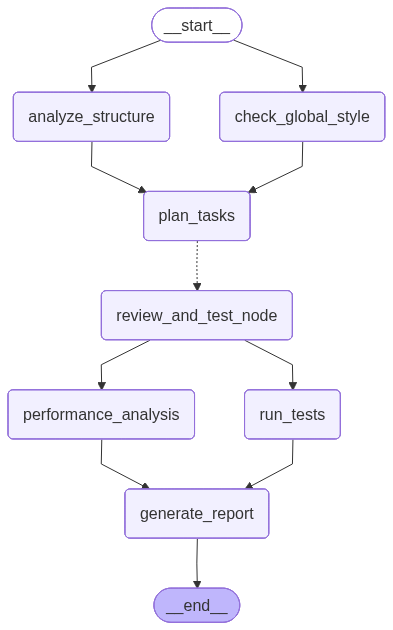
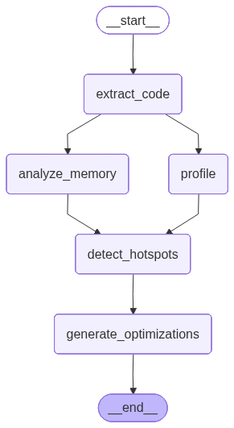

# Complex Code Review System V2

一个基于 LangGraph 构建的智能代码审查系统，支持 **Python**, **C**, **Go** 多语言项目。

## 特性

- **Map-Reduce 并行架构**: 自动将大项目拆分为多个子任务并行审查
- **智能项目结构分析**: Agent 自主探索目录结构，生成项目架构文档
- **自动测试生成**: 为每个模块自动生成功能测试和性能测试
- **多语言支持**: Python (pytest), Go (go test), C (gcc)

## 架构




## 目录结构

```
complex_code_review/
├── main.py                 # 入口文件
├── requirements.txt
├── reports/                # 生成的报告目录
├── tests/
│   ├── system/            # 系统自动生成的测试
│   └── user/              # 用户自定义测试
└── src/
    ├── agents/            # 智能代理
    │   ├── structure_agent.py   # 项目结构分析
    │   ├── planner_agent.py     # 任务分工
    │   ├── worker_agent.py      # 并行 Worker
    │   ├── test_runner.py       # 测试执行
    │   └── report_agent.py      # 报告生成
    ├── graph/
    │   └── workflow.py    # LangGraph 工作流定义
    ├── performance/       # 性能分析子图（热点/内存/动态剖析/优化建议）
    │   ├── perf_workflow.py      # 性能子图定义（extract_code -> analyze_memory/profile -> detect_hotspots -> generate_optimizations）
    │   ├── perf_state.py         # 性能子图状态
    │   ├── code_extractor.py     # 代码结构提取
    │   ├── memory_analyzer.py    # 内存风险点分析
    │   ├── profiler_agent.py     # 动态剖析（time/perf 等，终端实时输出 + 指标解析）
    │   ├── hotspot_detector.py   # 热点定位
    │   ├── optimization_advisor.py # 优化建议 + 性能报告生成
    ├── state/
    │   └── state.py       # 状态定义 (TypedDict)
    └── tools/
        ├── file_tools.py  # 文件操作工具
        └── test_tools.py  # 命令执行工具
```

## 使用方法

### 1. 安装依赖

```bash
pip install -r requirements.txt
```

### 2. 确保 Ollama 运行中

```bash
ollama serve
ollama pull qwen2.5-coder:7b
```

### 3. 运行审查

**基本用法**：

```bash
python main.py /path/to/your/project
```

**完整运行示例**：

包含性能分析 (`--perf`)、动态剖析 (`--profile`)、自定义测试脚本 (`-t`) 以及报告服务 (`--serve`) 的完整命令：

```bash
python main.py /home/elendilen/workspace/project \\
  --perf \\
  --profile \\
  --exec ./build/project_hw \\
  --exec-cwd /home/elendilen/workspace/project \\
  --exec-args "-i dataset/input_random.txt -o dataset/output_random.txt -v dataset/val_random.txt" \\
  -t "cd /home/elendilen/workspace/project/scripts && bash run.sh" \\
  --serve
```

*(注意：示例命令中已修正路径拼写 `worspace` -> `workspace`)*

### 4. 查看报告

报告将生成在 `reports/` 目录下（仅保存核心文档）：
- `project_structure.md` - 项目结构与架构说明
- `performance_analysis.md` - 深度性能分析报告（仅在启用 --perf 时生成）
- `style_report.md` - 代码风格检查报告

## 配置

默认使用 `qwen2.5-coder:7b` 模型。如需修改，编辑各 Agent 文件中的 `model_name` 参数。

## 可视化流程图

```bash
python visualize_complex_graph.py
python visualize_performance_graph.py
```

将生成 `complex_workflow_graph.png` 和 `performance_workflow_graph.png`。
